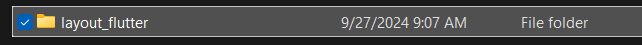
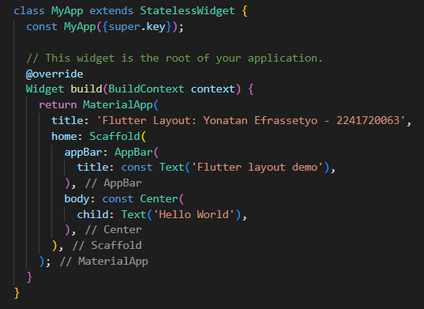
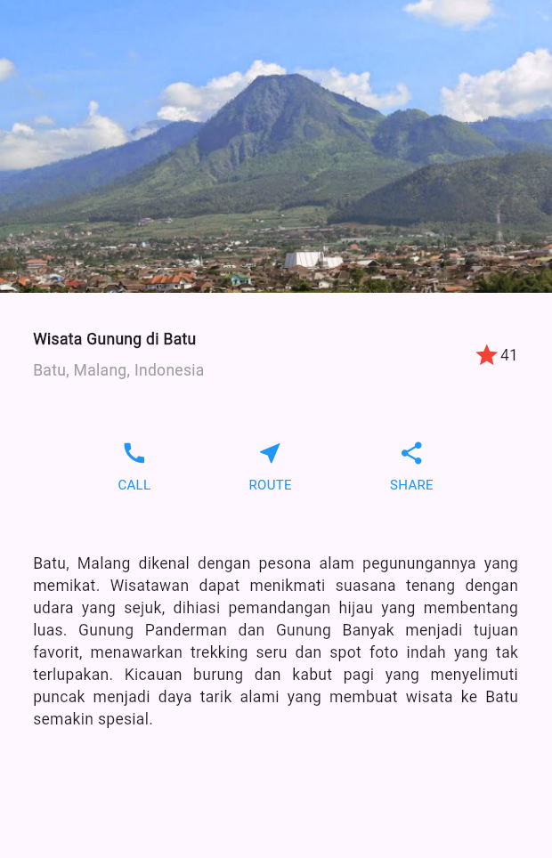
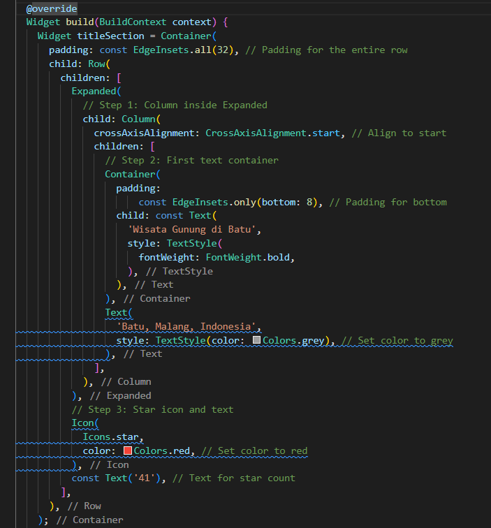
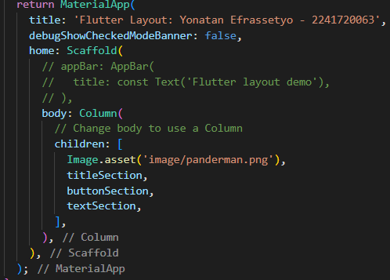

# Praktikum 1
## langkah 1
Buatlah sebuah project flutter baru dengan nama layout_flutter . Atau sesuaikan style laporan praktikum yang Anda buat.

 
## langkah 2
Buka file *main.dart* lalu ganti dengan kode berikut. Isi nama dan NIM Anda di text title.

**penjelasan :**

1. `import 'package:flutter/material.dart';` - Mengimpor paket material design Flutter.
2. `void main() => runApp(const MyApp());` - Fungsi `main()` menjalankan aplikasi dengan widget `MyApp` sebagai titik awal.
3. `class MyApp extends StatelessWidget` - `MyApp` adalah widget utama yang merupakan `StatelessWidget`.
4. `MaterialApp` - Membungkus aplikasi dengan widget `MaterialApp` untuk menggunakan fitur material design.
5. `Scaffold` - Struktur dasar untuk halaman dengan `appBar` (menampilkan judul) dan `body` yang berisi teks "Hello World" di tengah layar (`Center` widget).

## langkah 3
Langkah pertama adalah memecah tata letak menjadi elemen dasarnya:

Identifikasi baris dan kolom.
* Apakah tata letaknya menyertakan kisi-kisi (grid)?
* Apakah ada elemen yang tumpang tindih?
* Apakah UI memerlukan tab?
* Perhatikan area yang memerlukan alignment, padding, atau borders.
Pertama, identifikasi elemen yang lebih besar. Dalam contoh ini, empat elemen disusun menjadi sebuah kolom: sebuah gambar, dua baris, dan satu blok teks.

Selanjutnya, buat diagram setiap baris. Baris pertama, disebut bagian Judul, memiliki 3 anak: kolom teks, ikon bintang, dan angka. Anak pertamanya, kolom, berisi 2 baris teks. Kolom pertama itu memakan banyak ruang, sehingga harus dibungkus dengan widget yang Diperluas.

Baris kedua, disebut bagian Tombol, juga memiliki 3 anak: setiap anak merupakan kolom yang berisi ikon dan teks.

Setelah tata letak telah dibuat diagramnya, cara termudah adalah dengan menerapkan pendekatan bottom-up. Untuk meminimalkan kebingungan visual dari kode tata letak yang banyak bertumpuk, tempatkan beberapa implementasi dalam variabel dan fungsi.
## langkah 4
Pertama, Anda akan membuat kolom bagian kiri pada judul. Tambahkan kode berikut di bagian atas metode build() di dalam kelas MyApp:

/* soal 1 */ Letakkan widget Column di dalam widget Expanded agar menyesuaikan ruang yang tersisa di dalam widget Row. Tambahkan properti crossAxisAlignment ke CrossAxisAlignment.start sehingga posisi kolom berada di awal baris.

/* soal 2 */ Letakkan baris pertama teks di dalam Container sehingga memungkinkan Anda untuk menambahkan padding = 8. Teks ‘Batu, Malang, Indonesia' di dalam Column, set warna menjadi abu-abu.

/* soal 3 */ Dua item terakhir di baris judul adalah ikon bintang, set dengan warna merah, dan teks "41". Seluruh baris ada di dalam Container dan beri padding di sepanjang setiap tepinya sebesar 32 piksel. Kemudian ganti isi body text ‘Hello World' dengan variabel titleSection seperti berikut:

**penjelasan :**

Pada bagian `build(BuildContext context)`, saya mendefinisikan beberapa widget untuk membangun tampilan antarmuka aplikasi. 

1. **titleSection**:
   - Saya membuat `Container` dengan padding di seluruh sisinya sebesar 32 piksel. Di dalamnya, terdapat `Row` yang berfungsi untuk menempatkan elemen secara horizontal.
   - Saya menggunakan `Expanded` untuk memastikan kolom di dalamnya mengambil ruang yang tersisa. Di dalam kolom ini, saya menambahkan dua teks: 
     - Teks pertama, "Wisata Gunung di Batu", memiliki gaya teks tebal dengan padding di bawahnya.
     - Teks kedua menampilkan lokasi, "Batu, Malang, Indonesia", dengan warna abu-abu untuk memberikan kontras yang lembut.
   - Di sebelah kanan, saya menambahkan ikon bintang merah dan angka "41" sebagai rating atau jumlah ulasan.

2. **_buildButtonColumn**:
   - Saya mendefinisikan metode pembantu `_buildButtonColumn` untuk membuat kolom tombol yang berisi ikon dan teks. Metode ini menerima warna, ikon, dan label sebagai parameter.
   - Dalam metode ini, saya menggunakan `Column` untuk menempatkan ikon di atas teks dengan pengaturan posisi yang rapi.

3. **buttonSection**:
   - Saya membuat `Container` dengan padding 20 piksel yang berisi `Row` untuk menampung tiga tombol. 
   - Dengan menggunakan `mainAxisAlignment: MainAxisAlignment.spaceEvenly`, saya memastikan tombol-tombol tersebut terdistribusi secara merata. Setiap tombol memanggil `_buildButtonColumn` untuk menghasilkan tombol dengan ikon dan label "CALL", "ROUTE", dan "SHARE" dengan warna biru.

4. **textSection**:
   - Saya membuat bagian teks yang lebih panjang dengan padding 32 piksel. Teks ini menjelaskan tentang keindahan Batu, Malang, dan aktivitas wisata yang bisa dilakukan di sana. 
   - Saya menggunakan `TextAlign.justify` untuk memastikan teks terlihat rapi dan teratur di kedua sisi.

## Tampilan praktikum 1
