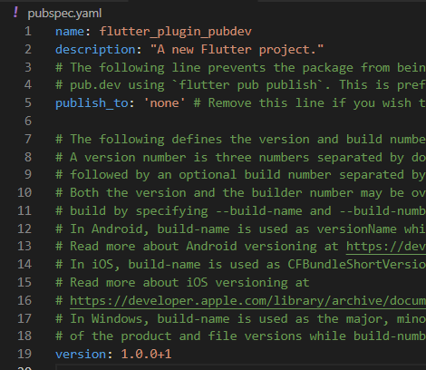

# **JOBSHEET 07 | Manajemen Plugin**

## Langkah 1

Buatlah sebuah project flutter baru dengan nama flutter_plugin_pubdev. Lalu jadikan repository di GitHub Anda dengan nama flutter_plugin_pubdev.

 

## Langkah 2

Tambahkan plugin auto_size_text menggunakan perintah berikut di terminal

Jika berhasil, maka akan tampil nama plugin beserta versinya di file pubspec.yaml pada bagian dependencies.

**penjelasan**

Perintah terminal di atas akan secara otomatis menambahkan plugin auto_size_text ke dalam file pubspec.yaml proyek. Ini adalah cara cepat untuk menambahkan dependensi tanpa perlu mengedit file pubspec.yaml secara manual. 

pada file pubspec.yaml terdapat informasi nama plugin dan juga versinya.

## Langkah 3

Buat file baru bernama red_text_widget.dart di dalam folder lib lalu isi kode seperti berikut.

**penjelasan**

Langkah ini merupakan pembuatan sebuah file baru bernama red_text_widget.dart, di mana didefinisikan class RedTextWidget yang nantinya akan digunakan untuk menampilkan teks berwarna merah di aplikasi. Untuk saat ini, metode build hanya mengembalikan widget kosong Container, namun ini akan diubah di langkah selanjutnya.

## Langkah 4

Masih di file red_text_widget.dart, untuk menggunakan plugin auto_size_text, ubahlah kode return Container() menjadi seperti berikut.

Setelah Anda menambahkan kode di atas, Anda akan mendapatkan info error. Mengapa demikian? Jelaskan dalam laporan praktikum Anda!

**penjelasan**

Error terjadi karena dua alasan utama: plugin auto_size_text belum ditambahkan di file pubspec.yaml, dan variabel text tidak didefinisikan di dalam class RedTextWidget. Untuk memperbaiki error, kita perlu menambahkan plugin dan memastikan variabel text didefinisikan dengan benar sebagai parameter widget.

## Langkah 5

Tambahkan variabel text dan parameter di constructor seperti berikut.

**penjelasan**

Dengan penambahan variabel text ini, widget RedTextWidget sekarang memiliki kemampuan untuk menerima input teks dari luar saat widget tersebut dibuat. Hal ini membuat widget lebih fleksibel untuk menampilkan teks yang berbeda sesuai kebutuhan pengguna.

## Langkah 6

**penjelasan**

* Container Pertama menggunakan widget RedTextWidget untuk menampilkan teks yang diberikan dengan gaya khusus contohnya, warna merah.
* Container Kedua menggunakan widget Text biasa untuk menampilkan teks yang sama tanpa modifikasi tambahan.
Kedua container ini memiliki latar belakang yang berbeda (kuning dan hijau) dan lebar yang berbeda (50 piksel dan 100 piksel), sehingga terlihat berbeda satu sama lain secara visual.

## Hasil Run

## **Tugas Praktikum**

(tugas 1-4 ada dibawah langkah tiap praktikum)

5. Jelaskan maksud dari tiap parameter yang ada di dalam plugin auto_size_text berdasarkan tautan pada dokumentasi ini !

* key:

    Mengontrol bagaimana satu widget menggantikan widget lain dalam tree. Ini berguna untuk memantau perubahan dalam tree widget.

* textKey:

    Menetapkan key untuk widget Text yang dihasilkan. Key ini berguna untuk melacak dan mengidentifikasi widget Text tertentu di dalam tree widget.

* style:

    Jika tidak null, parameter ini menentukan gaya teks yang digunakan, seperti warna, ukuran font, dan sebagainya.

* minFontSize:

    Menentukan batas minimum ukuran teks saat teks menyesuaikan ukurannya secara otomatis. Diabaikan jika presetFontSizes diatur.

* maxFontSize:

    Menentukan batas maksimum ukuran teks saat teks menyesuaikan ukurannya secara otomatis. Diabaikan jika presetFontSizes diatur.
    
* stepGranularity:

    Langkah atau tingkat adaptasi ukuran font saat menyesuaikan ukuran teks dengan batas yang ditentukan. Semakin besar nilai, semakin besar perubahan ukuran font dalam setiap langkah.

* presetFontSizes:

    Mendaftar semua ukuran font yang mungkin digunakan. presetFontSizes harus diatur dalam urutan menurun, dan jika diatur, parameter ini akan mengabaikan minFontSize dan maxFontSize.
    
* group:

    Menyinkronkan ukuran beberapa widget AutoSizeText agar ukurannya seragam di antara beberapa elemen.

* textAlign:

    Menentukan bagaimana teks akan disejajarkan secara horizontal dalam widget (misalnya, di tengah, kiri, kanan, dll.).

* textDirection:

    Menentukan arah teks (LTR atau RTL), yang mempengaruhi cara textAlign.start dan textAlign.end diinterpretasikan.

* locale:

    Digunakan untuk memilih font tertentu saat simbol Unicode yang sama dapat ditampilkan berbeda, tergantung pada locale.

* softWrap:

    Menentukan apakah teks harus dipotong saat mencapai batas baris yang lembut. Jika true, teks akan dipotong pada titik yang sesuai.

* wrapWords:

    Menentukan apakah kata-kata yang tidak muat dalam satu baris harus dipotong atau dibungkus ke baris berikutnya. Secara default, nilainya true untuk berperilaku seperti widget Text.

* overflow:

    Menentukan bagaimana overflow visual harus ditangani (misalnya, menggunakan elipsis jika teks terlalu panjang).

* overflowReplacement:

    Jika teks melampaui batas dan tidak muat di dalam area widget, maka widget ini akan ditampilkan sebagai pengganti.

* textScaleFactor:

    Mengatur skala font per pixel logis. Ini juga memengaruhi minFontSize, maxFontSize, dan presetFontSizes.

* maxLines:

    Menentukan jumlah maksimum baris yang boleh digunakan untuk menampilkan teks.

* semanticsLabel:

    Sebuah label semantik alternatif untuk teks ini, biasanya digunakan untuk tujuan aksesibilitas.

