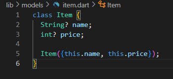

# **JOBSHEET 06 | Layout dan Navigasi di Flutter**

# **Praktikum 5**

## Langkah 1

Sebelum melanjutkan praktikum, buatlah sebuah project baru Flutter dengan nama belanja dan susunan folder seperti pada gambar berikut. Penyusunan ini dimaksudkan untuk mengorganisasi kode dan widget yang lebih mudah.

 

## Langkah 2

Buatlah dua buah file dart dengan nama home_page.dart dan item_page.dart pada folder pages. Untuk masing-masing file, deklarasikan class HomePage pada file home_page.dart dan ItemPage pada item_page.dart. Turunkan class dari StatelessWidget. Gambaran potongan kode dapat anda lihat sebagai berikut.

## Langkah 3

Setelah kedua halaman telah dibuat dan didefinisikan, bukalah file main.dart. Pada langkah ini anda akan mendefinisikan Route untuk kedua halaman tersebut. Definisi penamaan route harus bersifat unique. Halaman HomePage didefinisikan sebagai /. Dan halaman ItemPage didefinisikan sebagai /item. Untuk mendefinisikan halaman awal, anda dapat menggunakan named argument initialRoute. Gambaran tahapan ini, dapat anda lihat pada potongan kode berikut.

## Langkah 4

Sebelum melakukan perpindahan halaman dari HomePage ke ItemPage, dibutuhkan proses pemodelan data. Pada desain mockup, dibutuhkan dua informasi yaitu nama dan harga. Untuk menangani hal ini, buatlah sebuah file dengan nama item.dart dan letakkan pada folder models. Pada file ini didefinisikan pemodelan data yang dibutuhkan. Ilustrasi kode yang dibutuhkan, dapat anda lihat pada potongan kode berikut.

## Langkah 5

Pada halaman HomePage terdapat ListView widget. Sumber data ListView diambil dari model List dari object Item. Gambaran kode yang dibutuhkan untuk melakukan definisi model dapat anda lihat sebagai berikut.

## Langkah 6

Untuk menampilkan ListView pada praktikum ini digunakan itemBuilder. Data diambil dari definisi model yang telah dibuat sebelumnya. Untuk menunjukkan batas data satu dan berikutnya digunakan widget Card. Kode yang telah umum pada bagian ini tidak ditampilkan. Gambaran kode yang dibutuhkan dapat anda lihat sebagai berikut.

## Langkah 7

Item pada ListView saat ini ketika ditekan masih belum memberikan aksi tertentu. Untuk menambahkan aksi pada ListView dapat digunakan widget InkWell atau GestureDetector. Perbedaan utamanya InkWell merupakan material widget yang memberikan efek ketika ditekan. Sedangkan GestureDetector bersifat umum dan bisa juga digunakan untuk gesture lain selain sentuhan. Pada praktikum ini akan digunakan widget InkWell.

Untuk menambahkan sentuhan, letakkan cursor pada widget pembuka Card. Kemudian gunakan shortcut quick fix dari VSCode (Ctrl + . pada Windows atau Cmd + . pada MacOS). Sorot menu wrap with widget... Ubah nilai widget menjadi InkWell serta tambahkan named argument onTap yang berisi fungsi untuk berpindah ke halaman ItemPage. Ilustrasi potongan kode dapat anda lihat pada potongan berikut.

sebelum ditekan "Sugar"

setelah ditekan "sugar"

# **Tugas 2**

## soal 1

Untuk melakukan pengiriman data ke halaman berikutnya, cukup menambahkan informasi arguments pada penggunaan Navigator. Perbarui kode pada bagian Navigator menjadi seperti berikut.

*Navigator.pushNamed(context, '/item', arguments: item);*

**penjelasan**

Kode Navigator.pushNamed(context, '/item', arguments: item); digunakan untuk berpindah dari halaman HomePage ke halaman ItemPage. Fungsi pushNamed() menggunakan rute bernama '/item' untuk menentukan halaman tujuan, dan arguments: item mengirimkan data item yang dipilih agar dapat digunakan di halaman tujuan tersebut.

## soal 2

Pembacaan nilai yang dikirimkan pada halaman sebelumnya dapat dilakukan menggunakan ModalRoute. Tambahkan kode berikut pada blok fungsi build dalam halaman ItemPage. Setelah nilai didapatkan, anda dapat menggunakannya seperti penggunaan variabel pada umumnya. (https://docs.flutter.dev/cookbook/navigation/navigate-with-arguments)

*final itemArgs = ModalRoute.of(context)!.settings.arguments as Item;*

**penjelasan**

Baris kode final itemArgs = ModalRoute.of(context)!.settings.arguments as Item; digunakan untuk mendapatkan data yang dikirim dari halaman sebelumnya melalui argumen rute.

ModalRoute.of(context)! mengambil rute saat ini dan settings.arguments berisi argumen yang diteruskan saat navigasi dilakukan dari HomePage. Dalam hal ini, argumen tersebut adalah objek Item. Oleh karena itu, dilakukan casting (as Item) agar itemArgs dapat digunakan sebagai objek Item, sehingga memudahkan pengaksesan atributnya seperti name, price, stock, dan rating.

## soal 3

Pada hasil akhir dari aplikasi belanja yang telah anda selesaikan, tambahkan atribut foto produk, stok, dan rating. Ubahlah tampilan menjadi GridView seperti di aplikasi marketplace pada umumnya.

**penjelasan**

Bagian kode ini membuat tampilan dalam bentuk grid menggunakan GridView.builder(). Properti padding: EdgeInsets.all(8) menambahkan jarak di sekitar grid. itemCount: items.length menentukan jumlah item yang akan ditampilkan, sesuai jumlah elemen di daftar items.

gridDelegate menggunakan SliverGridDelegateWithFixedCrossAxisCount untuk mengatur tata letak grid, dengan:

* crossAxisCount: 2 berarti setiap baris memiliki dua kolom.
* crossAxisSpacing: 8 dan mainAxisSpacing: 8 menambahkan jarak antar kolom dan baris masing-masing sebesar 8 piksel, membuat tampilan lebih rapi.

## soal 4

Silakan implementasikan Hero widget pada aplikasi belanja Anda dengan mempelajari dari sumber ini: https://docs.flutter.dev/cookbook/navigation/hero-animations

**penjelasan**

Bagian kode ini menggunakan widget Hero untuk membuat animasi transisi yang halus saat navigasi antar halaman. Properti tag: 'itemImage${item.name}' memastikan bahwa elemen ini unik, sehingga Flutter dapat mengidentifikasi item yang ingin dianimasikan.

## soal 5

Sesuaikan dan modifikasi tampilan sehingga menjadi aplikasi yang menarik. Selain itu, pecah widget menjadi kode yang lebih kecil. Tambahkan Nama dan NIM di footer aplikasi belanja Anda.

**penjelasan**

Bagian kode ini menambahkan footer di halaman aplikasi yang berisi NIM (2241720063) dan nama saya (Yonatan Efrassetyo).

Padding digunakan untuk memberikan jarak sebesar 8.0 di sekeliling teks, agar tidak terlalu dekat dengan tepi layar. Widget Text digunakan untuk menampilkan 'Yonatan Efrassetyo - 2241720063'. Gaya teks diatur menggunakan TextStyle, dengan ukuran huruf (fontSize) sebesar 16 dan gaya huruf tebal (fontWeight: FontWeight.bold) untuk membuatnya lebih menonjol.

## soal 6

Selesaikan Praktikum 5: Navigasi dan Rute tersebut. Cobalah modifikasi menggunakan plugin go_router, lalu dokumentasikan dan push ke repository Anda berupa screenshot setiap hasil pekerjaan beserta penjelasannya di file README.md. Kumpulkan link commit repository GitHub Anda kepada dosen yang telah disepakati!

**penjelasan**

Pada file pubspec.yaml, baris go_router: ^6.0.0 digunakan untuk menambahkan paket go_router versi 6.0.0 atau versi yang lebih baru yang kompatibel

# Hasil Tampilan Tugas

## Home Page

## Item Page **(Sugar)**

## Item Page **(Salt)**

## Item Page **(Royco)**

## Item Page **(Nescafe)**

